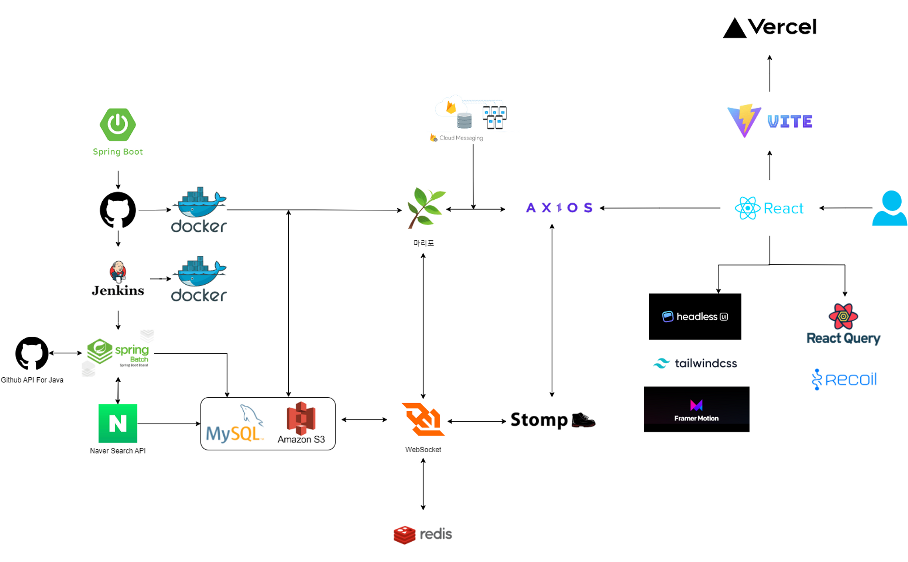
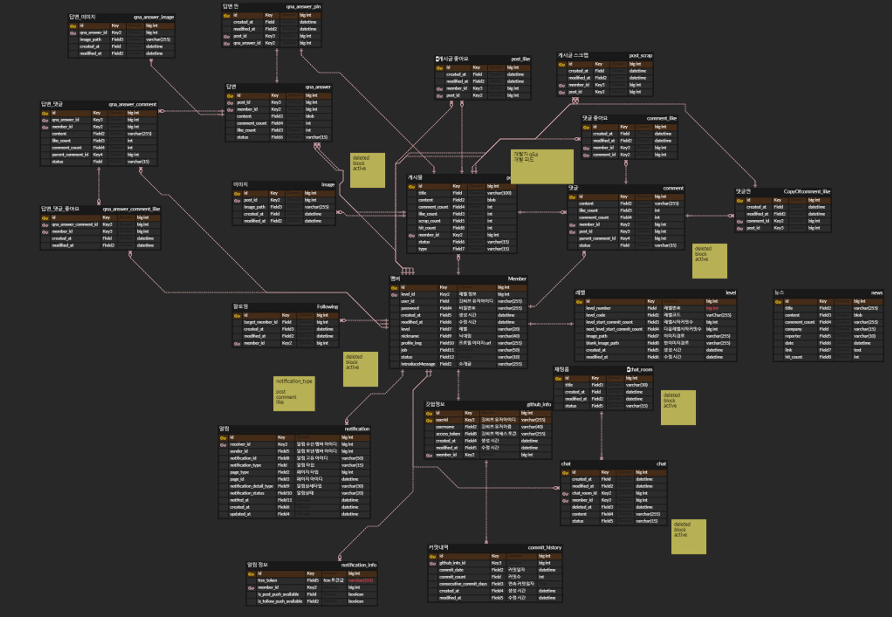

# BuDBackend

# 프로젝트 설명
🌱 꿈꾸는 모든 개발자분들의 개발 놀이터, 커뮤니티 플랫폼

# 프로젝트 기획
🥜 커밋으로 하나되는 우리들의 개발 놀이터. 하루하루 커밋하며 나무를 키워보세요!

🌱 경쟁과 함께, 빠른 변화들에 적응하며 달려야 하는 우리의 현실을 잠시 벗어나, 나만의 숲을 가꾸고 친구들과 함께 공유해보세요!

🌷 요즘 핫한 개발 트렌드는 뭐야? 최신 IT뉴스와 정보도 놓치지 말고 챙기세요!

🎄 우리들의 좌충우돌 개발 이야기, 현업 이야기를 함께 나누고 공유해보아요!

# 프로젝트 아키텍쳐

# ERD

# 주요 기능
1. 검색 및 필터 기능
2. 뉴스
3. 커뮤니티
4. 유저 간 실시간 채팅
5. 이미지 업로드
6. 실시간 알림 기능
7. Github Oauth 소셜 로그인
8. JWT를 이용한 사용자 인증
9. Github API를 이용한 커밋 기록 조회

# 노션 링크
https://statuesque-room-ee4.notion.site/BuD-bc8bae4d6bfd4032b5f92c6a13aef785
